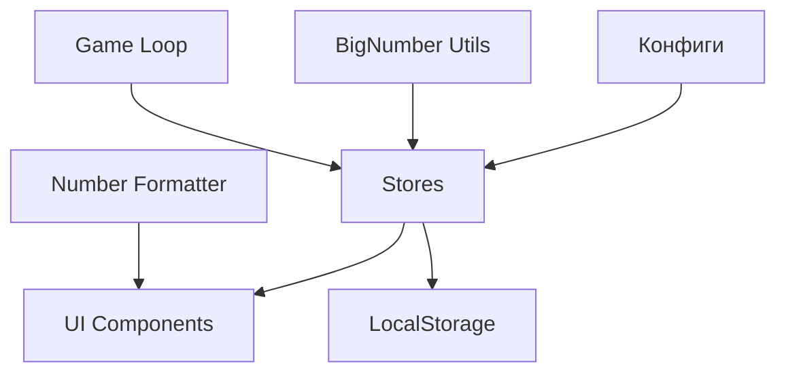

# 🎮 Масштабируемый Кликер

Современный idle-кликер с масштабируемой архитектурой, поддержкой больших чисел и системой престижа.

## ✨ Основные возможности

### 🔢 Система больших чисел
- **Библиотека**: `break_infinity.js` для чисел до e308 и выше
- **Wrapper**: Удобный API для всех операций с большими числами
- **Производительность**: Оптимизированные вычисления с кэшированием

### 📊 Умное форматирование
- **Смешанная нотация**:
  - До 1,000: обычные числа (1,234.5)
  - 1K - 1Dc (1e33): суффиксы (K, M, B, T, Qa, Qi, Sx, Sp, Oc, No, Dc)
  - После 1e33: научная нотация (1.23e45)
- **Динамические десятичные знаки**: больше точности для крупных чисел
- **2-4 значащих цифры**: цифры всегда изменяются интересно

### 🎯 Конфигурируемая система апгрейдов

**Типы апгрейдов:**
- **Активные**: Усиление кликов, множители кликов, критические удары
- **Пассивные**: Глобальное усиление, эффективность воркеров
- **Утилиты**: Автокликер
- **Специальные**: Уникальные эффекты

**Легкое добавление новых апгрейдов:**
```typescript
// src/configs/upgrades.ts
newUpgrade: {
  id: 'newUpgrade',
  name: 'Название',
  description: 'Описание эффекта',
  icon: '🎯',
  type: UpgradeType.CLICK,
  category: UpgradeCategory.ACTIVE,
  baseCost: D(100),
  costGrowth: 1.5,
  effect: (level: number) => ({
    type: 'multiplicative',
    target: 'click',
    value: D(Math.pow(1.2, level)),
  }),
}
```

### 👷 Система воркеров

**10 типов воркеров** с прогрессией силы:
1. Рабочий (0.1 Cr/s) - базовый
2. Инженер (1 Cr/s)
3. Мастер (10 Cr/s)
4. Архитектор (100 Cr/s)
5. Учёный (1K Cr/s)
6. Надзиратель (10K Cr/s)
7. Автоматон (100K Cr/s)
8. Кристаллизатор (1M Cr/s)
9. Синтезатор (10M Cr/s)
10. Трансцендент (100M Cr/s)

**Добавление нового воркера:**
```typescript
// src/configs/workers.ts
newWorker: {
  id: 'newWorker',
  name: 'Название',
  description: 'Описание',
  icon: '🤖',
  baseCps: D(1000),
  baseCost: D(50000),
  costGrowth: 1.15,
  order: 11,
  color: '#FF5722',
  unlockRequirement: {
    type: 'worker',
    targetId: 'transcendent',
    level: 5,
  },
}
```

### 🔄 Система множителей

**Централизованное управление бонусами:**
- Глобальные множители (влияют на всё)
- Множители кликов
- Множители производства
- Множители конкретных воркеров
- Множители от престижа

**Автоматическая композиция:**
```
finalValue = baseValue × globalMult × specificMult
```

### 🌟 Система престижа

**Престиж-валюта**: Кристаллы престижа
- **Формула награды**: `sqrt(totalCrystals / 1e6)`
- **Пример**: 100M кристаллов = 10 престиж-кристаллов

**Постоянные бонусы:**
- Каждый престиж-кристалл даёт +10% ко всему
- Престиж-апгрейды сохраняются навсегда

**Престиж-апгрейды:**
- Усиление производства (+25% за уровень)
- Усиление кликов (+50% за уровень)
- Эффективность воркеров (x2 за уровень)
- Автопрогресс (старт с 10 воркерами)
- Дешевле апгрейды (-5% за уровень)

## 🏗️ Архитектура

### Структура проекта

```
src/
├── components/          # UI компоненты
│   ├── UpgradeCard.tsx      # Карточка апгрейда
│   ├── WorkerCard.tsx       # Карточка воркера
│   ├── StatsPanel.tsx       # Панель статистики
│   └── PrestigePanel.tsx    # Панель престижа
│
├── configs/            # Конфигурации
│   ├── upgrades.ts          # Все апгрейды
│   ├── workers.ts           # Все воркеры
│   └── prestige.ts          # Настройки престижа
│
├── stores/             # State management (Zustand)
│   ├── gameStore.ts         # Основное состояние игры
│   ├── multiplierStore.ts   # Управление множителями
│   └── prestigeStore.ts     # Состояние престижа
│
├── types/              # TypeScript типы
│   ├── game.ts              # Основные типы игры
│   ├── upgrades.ts          # Типы апгрейдов
│   ├── workers.ts           # Типы воркеров
│   ├── multipliers.ts       # Типы множителей
│   └── prestige.ts          # Типы престижа
│
├── utils/              # Утилиты
│   ├── bigNumber.ts         # Wrapper для больших чисел
│   ├── numberFormatter.ts   # Форматирование чисел
│   └── migration.ts         # Миграция сохранений
│
├── hooks/              # React хуки
│   └── useGameLoop.ts       # Игровой цикл (RAF)
│
└── App.tsx             # Главный компонент
```

### Потоки данных



### State Management

**Zustand stores:**
- `gameStore` - кристаллы, воркеры, апгрейды, прогресс
- `multiplierStore` - все множители и бонусы
- `prestigeStore` - престиж-валюта и престиж-апгрейды

**Преимущества:**
- Простота использования
- Отличная производительность
- TypeScript из коробки
- Нет boilerplate

## 🚀 Масштабируемость

### Добавление новых элементов

#### 1. Новый тип апгрейда
Просто добавьте объект в `src/configs/upgrades.ts`:
```typescript
export const UPGRADES: Record<string, UpgradeConfig> = {
  // ... существующие
  newUpgrade: {
    // конфигурация
  },
}
```

#### 2. Новый воркер
Добавьте в `src/configs/workers.ts`:
```typescript
export const WORKERS: Record<string, WorkerConfig> = {
  // ... существующие
  newWorker: {
    // конфигурация
  },
}
```

#### 3. Новый множитель
Система автоматически подхватывает множители из апгрейдов и престижа.
Для custom логики используйте `multiplierStore.addMultiplier()`.

### Производительность

**Оптимизации:**
- ✅ `useMemo` для дорогих вычислений
- ✅ `memo` для компонентов списков
- ✅ RAF loop с throttling
- ✅ Кэширование степеней в BigNumber
- ✅ Батчинг операций с Decimal
- ✅ Lazy rendering для неразблокированных элементов

**Бенчмарки:**
- Decimal операции: ~10-50x медленнее нативных (не проблема для кликера)
- RAF: стабильные 60 FPS
- Рендеринг: <16ms даже с сотнями апгрейдов

## 💾 Сохранения

### Автосохранение
- Каждые 30 секунд
- После покупки воркера/апгрейда
- После престижа

### Оффлайн прогресс
Автоматический расчёт при загрузке:
```typescript
offlineCrystals = CPS × (currentTime - lastUpdate)
```

### Миграция
Автоматическая миграция из старых версий:
- v1 → v2: `number` → `Decimal`
- Бэкапы старых сохранений
- Безопасный fallback при ошибках

### Экспорт/Импорт
- Экспорт сохранения в base64
- Импорт с валидацией
- Автоматический бэкап перед импортом

## 🔧 Разработка

### Установка зависимостей
```bash
npm install
```

### Запуск dev сервера
```bash
npm run dev
```

### Сборка для продакшена
```bash
npm run build
```

### Preview продакшен сборки
```bash
npm run preview
```

## 📝 Best Practices

### При добавлении новых фич

1. **Конфигурация > Хардкод**
   - Все данные в `configs/`
   - Код должен быть generic

2. **Типизация**
   - Строгие TypeScript типы
   - Используйте `type` вместо `interface` где возможно

3. **Производительность**
   - Мемоизируйте дорогие вычисления
   - Используйте `memo` для списков
   - Избегайте лишних пересозданий объектов

4. **UI/UX**
   - Плавные анимации (CSS transitions)
   - Адаптивный дизайн
   - Понятные иконки и описания

## 🎨 Стилизация

- **CSS Modules** для изоляции стилей
- **SCSS** для удобства
- **CSS Custom Properties** для динамических значений
- **Mobile-first** подход

## 🐛 Debug

### Dev Mode
```typescript
const DEV_MODE = true // в App.tsx
```

Включает:
- Кнопку сброса игры
- Дополнительные логи
- Debug панель (опционально)

### Console Utils
```javascript
// Просмотр состояния
useGameStore.getState()
useMultiplierStore.getState()
usePrestigeStore.getState()

// Добавить кристаллов
useGameStore.getState().crystals = D(1e9)

// Престиж без подтверждения
usePrestigeStore.getState().performPrestige(D(1e9), () => {})
```

## 📦 Зависимости

### Production
- `react` - UI framework
- `zustand` - State management
- `break_infinity.js` - Большие числа

### Development
- `typescript` - Типизация
- `vite` - Сборщик
- `sass` - CSS препроцессор
- `eslint` - Линтер

## 🎯 Roadmap

### Возможные улучшения
- [ ] Система достижений
- [ ] Миссии и челленджи
- [ ] Темная тема
- [ ] Звуки и музыка
- [ ] Статистика и графики
- [ ] Cloud saves
- [ ] Мультиплеер (лидерборды)

## 📄 Лицензия

MIT

## 👨‍💻 Автор

Создано с ❤️ для демонстрации масштабируемой архитектуры кликеров.

